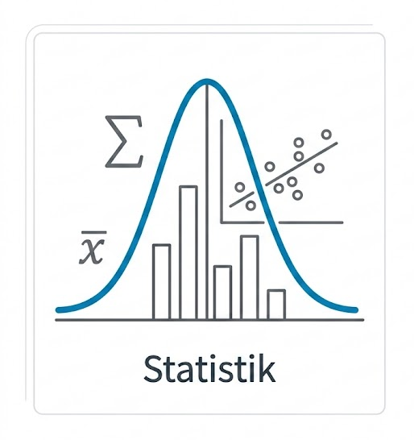

{.column-screen-metadata}

# Deskriptive Statistik
###### Arithmetisches Mittel
arithm. Mittel = $\sum \frac{Alle Werte}{Anzahl Werte}$

###### Median
mittlerer Wert; 50% der Werte sind größer und 50% der Werte sind kleiner

###### Modalwert
der am häufigsten vorkommende Wert

##### Geometrisches Mittel
n-te Wurzel aus dem Produkt der n Werte\\
stets kleiner als da arithmetische Mittel\\
geom. Mittel = $ \sqrt[n]{\prod_{i_1}^{n}x_i}

##### Quartil
teilt Datenreihe in vier gleich große Bereiche\\
25% der Daten liegen unter Q1 - unteres Quartil\\
Q2 - zweites Quantil entspricht dem Median\\
75% der Daten liegen unter Q3 - oberes Quartil\\
Interquartilsabstand (=Q3-Q1) enthält mittlere 50% der Daten

##### Quantil 
Verallgemeinerung Quartil\\
p-Quartil: links sind p der Werte, rechts 1-p\\
Q3 entspricht damit p = 75%


```markdown
```{r}
#| echo: true
# Beispiel: Mittelwert berechnen für M2
noten <- c(1.3, 2.0, 1.7, 3.3)
mean(noten)
```

